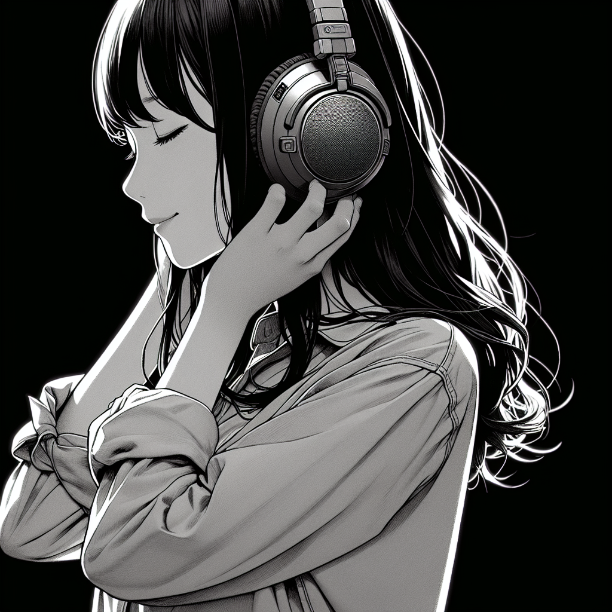
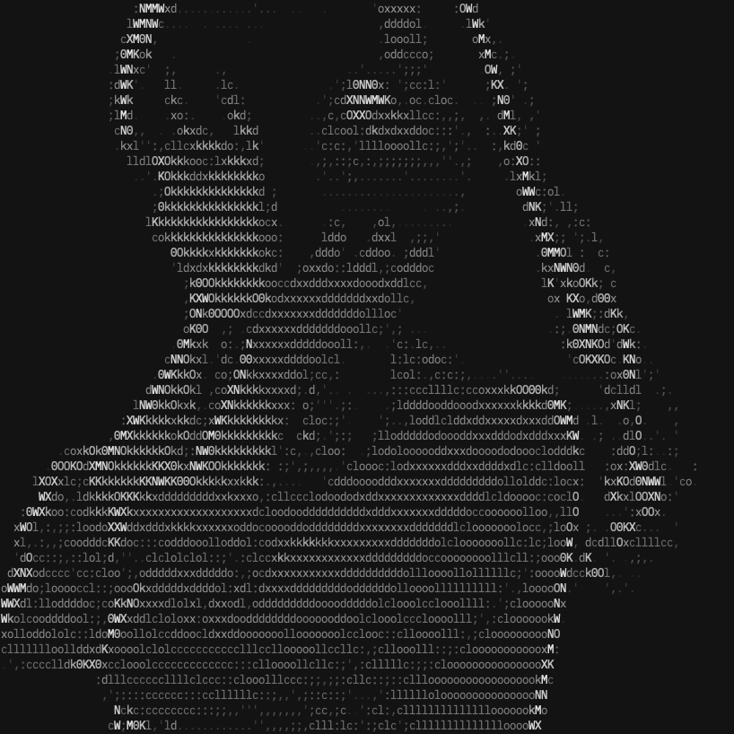

# dgen

## Examples

### Prompt

"high-contrast black and white Japanese anime illustration of a serene Japanese girl wearing cute headphones. She is depicted in a three-quarter view with her hand gently resting on one earpiece, enjoying the music. The image focuses on the texture of her hair and the soft expression on her face, all set against a pure black background to highlight the subject. Her hair is black and outline is white."

### Image



### Output



## Usage

```
Generate an image with DALL·E and display it on the terminal

Usage: dgen [OPTIONS] <PROMPT>

Arguments:
  <PROMPT>  Prompt to pass to DALL·E

Options:
  -a, --ascii    Convert an image to ASCII art
  -h, --help     Print help
  -V, --version  Print version
```

```sh
$ cargo build
$ ./target/debug/dgen "prompt"

or

$ cargo run -- "prompt"
```

## License

[Apache-2.0](./LICENSE)
